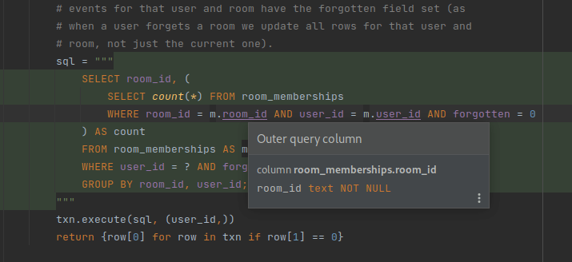

# Schema symlinks

This directory contains symlinks to the latest dump of the postgres full schema. This is useful to have, as it allows IDEs to understand our schema and provide autocomplete, linters, inspections, etc.

In particular, the DataGrip functionality in IntelliJ's products seems to only consider files called `*.sql` when defining a schema from DDL; `*.sql.postgres` will be ignored. To get around this we symlink those files to ones ending in `.sql`. We've chosen to ignore the `.sql.sqlite` schema dumps here, as they're not intended for production use (and are much quicker to test against).

## Example

## Caveats

- Doesn't include temporary tables created ad-hoc by Synapse.
- Postgres only. IDEs will likely be confused by SQLite-specific queries.
- Will not include migrations created after the latest schema dump.
- Symlinks might confuse checkouts on Windows systems.

## Instructions

### Jetbrains IDEs with DataGrip plugin

- View -> Tool Windows -> Database
- `+` Icon -> DDL Data Source
- Pick a name, e.g. `Synapse schema dump`
- Under sources, click `+`.
- Add an entry with Path pointing to this directory, and dialect set to PostgreSQL.
- OK, and OK.
- IDE should now be aware of the schema.
- Try control-clicking on a table name in a bit of SQL e.g. in `_get_forgotten_rooms_for_user_txn`.